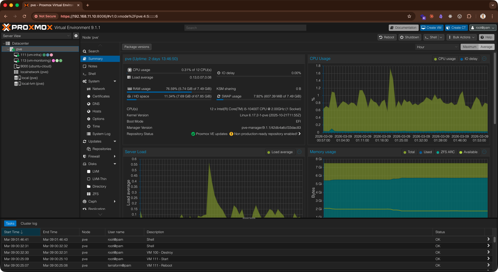
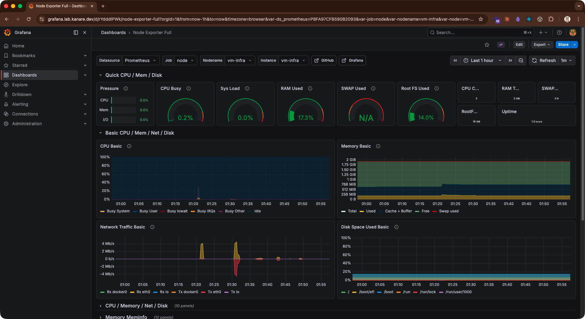
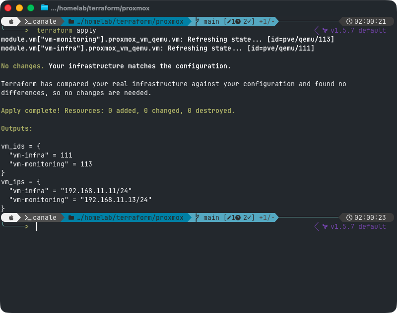
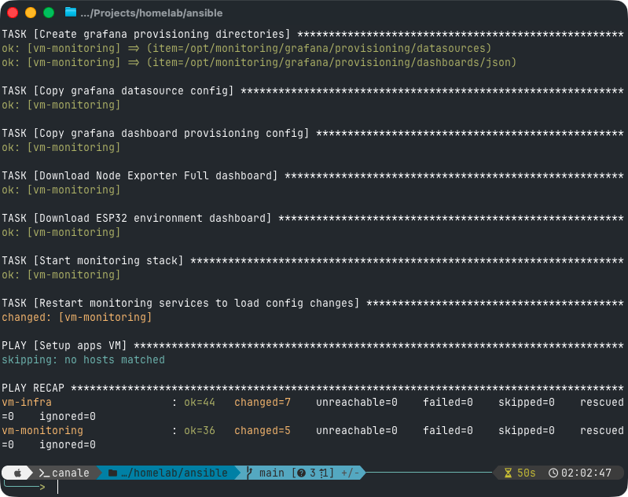

# homelab

Proxmox 上に複数 VM を構築し、Terraform + Ansible + Docker Compose で再現可能に運用する homelab リポジトリ。

現在は `8GB RAM` の ThinkCentre Tiny を前提に、まず無理なく常時運用できる最小構成を優先している。主役は `vm-infra` と `vm-monitoring`、`vm-dev` は必要なときに自由に壊して試せる検証用 VM とする。

## 現在の運用方針

- 常時起動は `vm-infra` と `vm-monitoring`
- `vm-dev` は Ansible や Docker の検証用に必要時だけ起動
- `vm-apps` はメモリ増設後に追加する将来拡張枠
- まずは DNS、reverse proxy、monitoring の再現性を固める

## 思想

- **再現可能性**: すべての構成をコードで管理し、いつでも同じ環境を再構築できる
- **最小構成から育てる**: まずは軽量な構成で動かし、必要に応じて段階的に拡張する
- **ドキュメント駆動**: このリポジトリを読めば全体像、命名規約、セットアップ手順が分かる
- **観測可能性**: Prometheus と Grafana で VM やサービスの状態を継続的に可視化する

## 構成図


## 現行アーキテクチャ

```text
┌─────────────────────────────────────────────────────────┐
│  LAN: 192.168.11.0/24          GW: 192.168.11.1         │
│                                                         │
│  ┌──────────────┐  ┌───────────────┐  ┌──────────────┐  │
│  │  vm-infra    │  │ vm-monitoring │  │ vm-dev       │  │
│  │  .11         │  │  .13          │  │   .21        │  │
│  │  CoreDNS     │  │  Prometheus   │  │ playground   │  │
│  │  Caddy       │  │  Grafana      │  │ optional     │  │
│  │  WireGuard   │  │  node_exporter│  │              │  │
│  └──────┬───────┘  └──────┬────────┘  └──────┬───────┘  │
│         │                 │                  │          │
│  ┌──────┴─────────────────┴──────────────────┴────────┐ │
│  │                  Proxmox VE (.10)                  │ │
│  └────────────────────────────────────────────────────┘ │
│                                                         │
│  ┌──────────────┐                                       │
│  │  IoT devices │                                       │
│  │  .100~       │                                       │
│  │  ESP32 etc.  │                                       │
│  └──────────────┘                                       │
└─────────────────────────────────────────────────────────┘
```

## なぜこの構成から始めるか

| 観点 | 判断 |
| --- | --- |
| メモリ制約 | 8GB ホストでは常時起動 VM を絞った方が安定しやすい |
| 優先順位 | まずは DNS、reverse proxy、monitoring をコード化して再現性を固めたい |
| 学習効率 | `vm-dev` があると、設定や playbook を安全に壊して試せる |
| 拡張性 | 将来 `vm-apps` や Home Assistant を追加しやすい |

## ハードウェア

| 機器 | モデル | スペック | IP | 備考 |
| --- | --- | --- | --- | --- |
| ルーター | Buffalo WSR-1800AX4P | — | `192.168.11.1` | 現在利用中 |
| サーバー | Lenovo ThinkCentre M70q Tiny | i5-10400T / 8GB RAM / 256GB NVMe | `192.168.11.10` | Proxmox VE ホスト |
| IoT | ESP32 | — | `192.168.11.100` | Prometheus metrics を公開予定 |

## 8GB 前提のメモリ配分目安

| 対象 | 用途 | 目安メモリ | 備考 |
| --- | --- | ---: | --- |
| Proxmox host | ハイパーバイザ本体 | 2GB | ホスト側の余裕を削りすぎない |
| `vm-infra` | CoreDNS / Caddy / WireGuard | 768MB-1GB | 軽量構成なら十分 |
| `vm-monitoring` | Prometheus / Grafana | 2GB | まずはここを厚めに確保 |
| `vm-dev` | 検証用 Ubuntu | 1GB | 常時起動しない前提 |
| 余白 | キャッシュ / 一時負荷 / 将来拡張 | 2GB 前後 | 一番重要なバッファ |

## 技術スタック

| レイヤ | 採用技術 | 用途 |
| --- | --- | --- |
| ハイパーバイザ | Proxmox VE | VM の作成・実行・管理 |
| IaC | Terraform | Proxmox 上の VM プロビジョニング |
| 構成管理 | Ansible | OS 初期設定、Docker、node_exporter、監視基盤のデプロイ |
| コンテナ実行 | Docker Compose | Prometheus、Grafana、reverse proxy の起動 |
| 監視 | Prometheus, Grafana, node_exporter | VM / ホスト / IoT のメトリクス収集と可視化 |
| ネットワーク | CoreDNS, Caddy, WireGuard | 内部 DNS、reverse proxy、VPN |
| 秘密情報管理 | SOPS + age, Ansible Vault | 機密情報の暗号化と運用 |

## 現在の VM 一覧

| 名前 | VMID | IP | 状態 | 役割 | 主なサービス |
| --- | --- | --- | --- | --- | --- |
| Proxmox | — | `192.168.11.10` | 常時起動 | ハイパーバイザ | Proxmox VE |
| `vm-infra` | `111` | `192.168.11.11` | 常時起動 | インフラ基盤 | CoreDNS, Caddy, WireGuard（将来追加予定） |
| `vm-monitoring` | `113` | `192.168.11.13` | 常時起動 | 監視 | Prometheus, Grafana, node_exporter |
| `vm-dev` | `121` | `192.168.11.21` | 任意起動 | 開発・実験 | playground |
| `vm-apps` | `120` | `192.168.11.20` | まだ未使用 | 将来のアプリ用 | Home Assistant / 各種サービス候補 |

## 管理画面リンク

| サービス | IP | ドメイン | 備考 |
| --- | --- | --- | --- |
| ルーター | [http://192.168.11.1](http://192.168.11.1) | — | ルーター設定画面 |
| Proxmox | [https://192.168.11.10:8006](https://192.168.11.10:8006) | — | Proxmox VE 管理画面（直接アクセス） |
| Grafana | [http://192.168.11.13:3000](http://192.168.11.13:3000) | [https://grafana.lab.kanare.dev](https://grafana.lab.kanare.dev) | 監視ダッシュボード |
| Prometheus | [http://192.168.11.13:9090](http://192.168.11.13:9090) | [https://prometheus.lab.kanare.dev](https://prometheus.lab.kanare.dev) | メトリクス確認 |

## IP アドレス規約

| 範囲 | 用途 | 例 |
| --- | --- | --- |
| `192.168.11.1` | ルーター / ゲートウェイ | — |
| `192.168.11.10–19` | インフラ（Proxmox, VM） | `.10` Proxmox, `.11` `vm-infra`, `.13` `vm-monitoring` |
| `192.168.11.20–59` | サーバー / 検証用 VM | `.20` `vm-apps` 予約, `.21` `vm-dev` |
| `192.168.11.60–99` | DHCP プール | 動的割当 |
| `192.168.11.100–149` | IoT デバイス | `.100` ESP32 |
| `192.168.11.150–254` | 予約 / 実験用 | — |

## ドメイン命名規約

内部 DNS では `lab.kanare.dev` ゾーンを使い、サービスや VM を名前で引けるようにする。

| FQDN | DNS 解決先 | 実際の宛先 | 用途 | 状態 |
| --- | --- | --- | --- | --- |
| `pve.lab.kanare.dev` | `192.168.11.11` (Caddy) | `192.168.11.10:8006` | Proxmox Web UI | 未対応（直接 IP でアクセス） |
| `infra.lab.kanare.dev` | `192.168.11.11` | `192.168.11.11` | `vm-infra` 管理用 | 利用中 |
| `grafana.lab.kanare.dev` | `192.168.11.11` (Caddy) | `192.168.11.13:3000` | Grafana | 利用中 |
| `prometheus.lab.kanare.dev` | `192.168.11.11` (Caddy) | `192.168.11.13:9090` | Prometheus | 利用中 |
| `dev.lab.kanare.dev` | `192.168.11.21` | `192.168.11.21` | `vm-dev` | 任意起動 |
| `apps.lab.kanare.dev` | `192.168.11.20` | `192.168.11.20` | 将来のアプリ VM | 予約 |

## DNS / Reverse Proxy / Monitoring

### DNS

- 内部 DNS は `lab.kanare.dev`
- `vm-infra` 上で CoreDNS を動かす
- `grafana.lab.kanare.dev` と `prometheus.lab.kanare.dev` を reverse proxy の入口にする

### Reverse Proxy

- `vm-infra` 上で Caddy を使う
- LAN 内でも TLS を有効化しやすく、設定が簡潔
- 将来アプリを追加しても同じ入口に集約できる

### Monitoring

- `vm-monitoring` 上で Prometheus と Grafana を動かす
- まずは各 VM の `node_exporter` を監視する
- 将来的に ESP32 や Alertmanager を追加する

## 将来拡張

以下は現在の最小構成とは分けて扱う。

- `vm-apps` を有効化して Home Assistant などのアプリを載せる
- VLAN を導入して Management / Servers / Clients / IoT / Guests を分離する
- Alertmanager を追加して Slack / Discord 通知を行う
- Loki + Promtail でログ収集を追加する
- メモリ増設後に k3s などの重めの構成を検討する

## リポジトリ構成

```text
homelab/
├── README.md
├── terraform/
│   └── proxmox/
├── ansible/
│   ├── inventory/
│   ├── roles/
│   └── playbooks/
├── docker/
│   └── compose/
│       ├── monitoring/
│       └── reverse-proxy/
├── diagrams/
└── docs/
```

## Quick Start

### 前提条件

- [Terraform](https://www.terraform.io/) >= 1.5
- [Ansible](https://docs.ansible.com/) >= 2.15
- Proxmox VE 8.x が `192.168.11.10` で稼働済み
- 対象 VM に SSH 鍵認証でログインできること

> [!IMPORTANT]
> Terraform の Proxmox provider には API トークンが必要。`terraform/proxmox/README.md` の手順に従い、事前に Proxmox 側でトークンを発行する。

### 1. リポジトリをクローン

```bash
git clone https://github.com/<your-user>/homelab.git
cd homelab
```

### 2. Core VM をプロビジョニング

```bash
cd terraform/proxmox
cp terraform.tfvars.example terraform.tfvars
# terraform.tfvars を編集
terraform init
terraform plan
terraform apply
```

まずは `vm-infra` と `vm-monitoring` を優先し、`vm-dev` は必要になってから追加する。

### 3. VM を構成

```bash
cd ansible
# inventory/hosts.yml を環境に合わせて編集
ansible-playbook playbooks/site.yml
```

### 4. 動作確認

```bash
# DNS
dig @192.168.11.11 grafana.lab.kanare.dev

# Grafana
open http://192.168.11.13:3000

# Prometheus
open http://192.168.11.13:9090
```

詳細な手順は `docs/next.md` を参照。

## Screenshots

### Proxmox VE — VM 稼働状況

Terraform でプロビジョニングした vm-infra (111) と vm-monitoring (113) が running 状態。



### Grafana — Node Exporter ダッシュボード

`https://grafana.lab.kanare.dev`（CoreDNS + Caddy 経由）で Grafana にアクセスし、
node_exporter で収集した VM のメトリクスを可視化している。



### Terraform — 構成の冪等性

`terraform apply` を実行すると `No changes.` となり、実インフラがコードと完全に一致していることを確認。



### Ansible — Playbook 実行結果

`ansible-playbook` で vm-infra・vm-monitoring の両 VM に設定を適用。`failed=0` で正常完了。



## セキュリティ

- **秘密情報は Git に入れない**: `.env`, `terraform.tfvars`, Ansible Vault ファイルは除外する
- **SOPS + age** を推奨: 暗号化した状態で Git 管理可能
- **Ansible Vault**: `ansible-vault encrypt` で変数ファイルを暗号化
- **LAN 内 TLS**: Caddy の内部 CA 機能でローカル証明書を自動発行
- **SSH 鍵認証のみ**: パスワード認証は無効化する
- **ファイアウォール**: `ufw` で必要なポートのみ開放する
