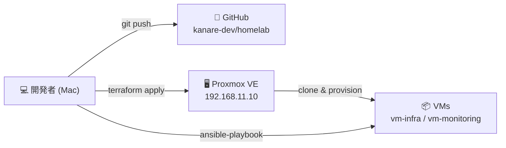
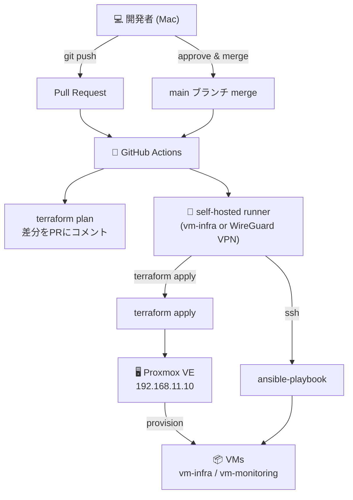

# CI/CD 構成図（下書き）

Terraform + Ansible による infrastructure as code の全体フローをまとめる。
将来的に GitHub Actions で自動化することを見据えた設計。

## 現在のフロー（手動）

```ascii
開発者 (Mac)
  │
  ├─ terraform apply ──→ Proxmox API ──→ VM 作成 / 更新
  │
  ├─ ansible-playbook ──→ SSH ──→ VM 設定・サービスデプロイ
  │
  └─ git push ──→ GitHub (kanare-dev/homelab)
```



## 将来のフロー（GitHub Actions 自動化）

### 前提条件

- GitHub Actions の self-hosted runner を LAN 内 VM（vm-infra 等）に配置する
- または WireGuard VPN 経由で GitHub hosted runner から LAN に接続する
- Proxmox API トークン・SSH 秘密鍵を GitHub Secrets に登録する

### フロー

```ascii
開発者 (Mac)
  │
  ├─ PR 作成
  │     └─ GitHub Actions
  │           └─ terraform plan → PR にコメント（差分を表示）
  │
  └─ main へ merge
        └─ GitHub Actions
              ├─ terraform apply → Proxmox API → VM 作成 / 更新
              └─ ansible-playbook → SSH → VM 設定・サービスデプロイ
```



## 実装に向けた課題

| 課題 | 詳細 | 解決策 |
| --- | --- | --- |
| プライベート LAN へのアクセス | GitHub hosted runner は `192.168.11.x` に届かない | self-hosted runner または WireGuard VPN |
| Terraform の自動 apply リスク | 意図しない VM 削除の可能性 | PR 時は `plan` のみ、`apply` はレビュー後 |
| 秘密情報の管理 | Proxmox API トークン・SSH 鍵が必要 | GitHub Secrets に登録 |

## ロードマップ上の位置づけ

WireGuard を導入したあとが自動化の現実的な入口。

1. WireGuard で外部から LAN に入れるようにする
2. GitHub Actions self-hosted runner を vm-infra に配置
3. PR 時に `terraform plan` を自動実行
4. main merge 時に `ansible-playbook` を自動実行
5. `terraform apply` の自動化は慎重に検討
